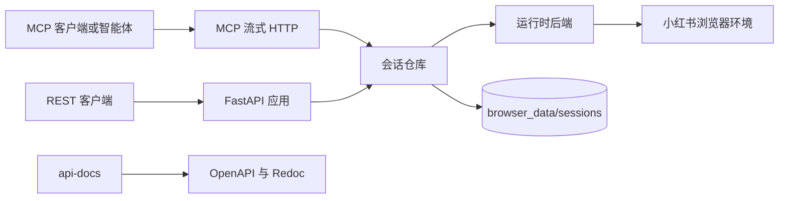

# 小红书接口层

[](https://www.python.org/)
[](https://fastapi.tiangolo.com/)
[](https://modelcontextprotocol.io/)
[](LICENSE)

小红书接口层是面向小红书数据工作流的 Python 服务。它把浏览器会话、登录态验证、搜索、打开帖子、评论分页和诊断信息封装成一致的 REST 接口与 MCP 工具，方便上层应用、自动化脚本和智能体复用同一套会话/令牌模型。

> 项目仍处于开发阶段。请仅在你有权限、合规且符合目标平台规则的场景中使用。

## 功能

- **双入口服务**：同时提供 REST 接口和 MCP 流式 HTTP 入口。
- **会话编排**：集中管理会话创建、绑定、解绑、恢复、销毁和占用保护。
- **多种登录动作**：支持 Cookie、二维码、手机号开始登录和验证码提交。
- **上下文安全**：搜索结果、帖子详情、根评论和子评论按会话上下文串行推进。
- **统一响应结构**：成功与错误响应都带 `meta.request_id`、`operation` 和可追踪状态。
- **双语接口文档**：`api-docs/` 内维护中文、英文 OpenAPI 文档和 Redoc 预览。

## 目录

- [架构](#架构)
- [环境要求](#环境要求)
- [安装](#安装)
- [快速开始](#快速开始)
- [运行模式](#运行模式)
- [REST 接口](#rest-接口)
- [MCP 接入](#mcp-接入)
- [接口文档](#接口文档)
- [配置](#配置)
- [项目结构](#项目结构)
- [开发](#开发)
- [开发计划](#开发计划)
- [参与贡献](#参与贡献)
- [许可证](#许可证)

## 架构



FastAPI 应用入口：

```text
interface_layer.app:create_app
```

服务挂载入口：

- REST 接口：`/v1/*`、`/admin/v1/*`
- MCP 流式 HTTP：`/mcp`

## 环境要求

- Python 3.11+
- 真实小红书运行模式需要 Playwright 可用的 Chromium 浏览器环境
- 只有预览或重新生成 `api-docs/` 时才需要 Node.js 18+

Python 依赖同时声明在 `pyproject.toml` 和 `requirements.txt` 中。

## 安装

```powershell
python -m venv .venv
.\.venv\Scripts\Activate.ps1
python -m pip install -r requirements.txt
python -m playwright install chromium
```

## 快速开始

### 1. 启动服务

```powershell
uvicorn interface_layer.app:create_app --factory --host 127.0.0.1 --port 8000
```

启动时，服务会打印一个临时管理员令牌：

```text
XHS interface admin token: <token>
```

该令牌只用于强制解绑、销毁会话等管理接口。

### 2. 创建并绑定会话

```powershell
$base = "http://127.0.0.1:8000"

$created = Invoke-RestMethod -Method Post `
  -Uri "$base/v1/sessions" `
  -ContentType "application/json" `
  -Body '{"purpose":"demo"}'

$sessionId = $created.data.session_id
$bound = Invoke-RestMethod -Method Post -Uri "$base/v1/sessions/$sessionId/bind"
$token = $bound.data.token
```

### 3. 执行登录动作

Cookie 登录需要传入包含小红书浏览器凭证的 Cookie 字符串。

```powershell
Invoke-RestMethod -Method Post `
  -Uri "$base/v1/sessions/$sessionId/login" `
  -ContentType "application/json" `
  -Body (@{
    token = $token
    action = "cookie"
    cookie = "a1=...; web_session=..."
  } | ConvertTo-Json)
```

调用搜索、帖子或评论接口前，必须先确认登录态：

```powershell
Invoke-RestMethod -Method Get -Uri "$base/v1/sessions/$sessionId/login/status?token=$token"
```

### 4. 搜索、打开帖子并读取评论

```powershell
$search = Invoke-RestMethod -Method Post `
  -Uri "$base/v1/sessions/$sessionId/search" `
  -ContentType "application/json" `
  -Body (@{
    token = $token
    keyword = "咖啡"
    sort = "general"
    page = 1
    page_size = 20
    limit = 20
  } | ConvertTo-Json)

$noteId = $search.data.items[0].note_id

Invoke-RestMethod -Method Post `
  -Uri "$base/v1/sessions/$sessionId/notes/open-from-search" `
  -ContentType "application/json" `
  -Body (@{ token = $token; note_id = $noteId } | ConvertTo-Json)

Invoke-RestMethod -Method Post `
  -Uri "$base/v1/sessions/$sessionId/comments/root" `
  -ContentType "application/json" `
  -Body (@{ token = $token; note_id = $noteId; limit = 10 } | ConvertTo-Json)
```

工作流结束后释放会话：

```powershell
Invoke-RestMethod -Method Post `
  -Uri "$base/v1/sessions/$sessionId/unbind" `
  -ContentType "application/json" `
  -Body (@{ token = $token } | ConvertTo-Json)
```

## 运行模式

默认使用真实小红书运行时：

```powershell
$env:XHS_INTERFACE_RUNTIME = "xhs"
```

本地接口实验可切换到模拟模式，避免驱动浏览器运行时：

```powershell
$env:XHS_INTERFACE_RUNTIME = "mock"
uvicorn interface_layer.app:create_app --factory --host 127.0.0.1 --port 8000
```

## REST 接口

核心接口：

| 模块 | 接口 |
| --- | --- |
| 会话 | `GET /v1/sessions` |
| 会话 | `POST /v1/sessions` |
| 会话 | `POST /v1/sessions/{session_id}/bind` |
| 会话 | `POST /v1/sessions/{session_id}/unbind` |
| 登录 | `POST /v1/sessions/{session_id}/login` |
| 登录 | `GET /v1/sessions/{session_id}/login/status` |
| 搜索 | `POST /v1/sessions/{session_id}/search` |
| 笔记 | `POST /v1/sessions/{session_id}/notes/open-from-search` |
| 笔记 | `POST /v1/sessions/{session_id}/notes/open-by-xsec` |
| 评论 | `POST /v1/sessions/{session_id}/comments/root` |
| 评论 | `POST /v1/sessions/{session_id}/comments/sub` |
| 诊断 | `GET /v1/sessions/{session_id}/diagnostics` |
| 管理 | `POST /admin/v1/sessions/{session_id}/force-unbind` |
| 管理 | `DELETE /admin/v1/sessions/{session_id}` |

成功响应结构：

```json
{
  "ok": true,
  "data": {},
  "meta": {
    "request_id": "req_0000000000000000",
    "operation": "createSession",
    "session_id": "optional-session-id"
  }
}
```

## MCP 接入

MCP 复用 REST 接口的会话/令牌模型。连接地址：

```text
http://127.0.0.1:8000/mcp/
```

Python 客户端最小示例：

```python
import anyio
from mcp import ClientSession
from mcp.client.streamable_http import streamablehttp_client


async def main():
    async with streamablehttp_client("http://127.0.0.1:8000/mcp/") as (read, write, _):
        async with ClientSession(read, write) as session:
            await session.initialize()
            tools = await session.list_tools()
            print([tool.name for tool in tools.tools])

            created = await session.call_tool("xhs_session_create", {"purpose": "mcp-demo"})
            print(created.structuredContent)


anyio.run(main)
```

可用工具：

```text
xhs_session_list
xhs_session_create
xhs_session_bind
xhs_session_unbind
xhs_login_run_action
xhs_login_get_status
xhs_search_posts
xhs_note_open_from_search
xhs_note_open_by_xsec
xhs_comment_fetch_root
xhs_comment_fetch_sub
```

只读资源：

```text
xhs://sessions
xhs://session/{session_id}/state
xhs://session/{session_id}/diagnostics
```

工作流提示词：

```text
xhs_cookie_login_workflow
xhs_search_open_comment_workflow
xhs_recover_from_context_error
```

## 接口文档

OpenAPI 源文件和文档工具链都收束在 `api-docs/`。

```powershell
cd api-docs
npm install
npm run build:i18n
npm run preview
```

打开预览地址：

```text
http://127.0.0.1:8088/site/
```

默认展示中文界面。也可以从页面右上角切换英文，或直接访问：

```text
http://127.0.0.1:8088/site/?lang=en
```

不要直接编辑 `api-docs/openapi/dist/` 下的生成产物。修改接口结构时，先更新 `openapi.base.yaml` 和翻译文件，再重新生成。

## 配置

| 环境变量 | 默认值 | 说明 |
| --- | --- | --- |
| `XHS_INTERFACE_RUNTIME` | `xhs` | 运行时后端。本地 mock 行为使用 `mock`。 |
| `XHS_INTERFACE_PROFILE_ROOT` | `browser_data/sessions` | 会话持久化和浏览器资料目录根路径。 |
| `XHS_INTERFACE_DEBUG` | 未设置 | 设为 `1`、`true`、`yes` 或 `on` 时，在服务端错误中包含调试信息。 |

运行时数据按会话持久化：

```text
browser_data/sessions/<session_id>/session.json
browser_data/sessions/<session_id>/profile/
```

服务重启后，已持久化的会话会以 `idle` 状态重新加载。令牌和短期运行时上下文不会保留，客户端需要重新绑定，并重新验证登录态后再继续工作。

## 项目结构

```text
interface-layer/
├── interface_layer/
│   ├── api/              # FastAPI 依赖、响应、异常处理和路由
│   ├── mcp/              # MCP 服务、工具、资源、提示词和结构定义
│   ├── models/           # Pydantic 请求与响应模型
│   ├── runtime/          # 运行时适配器、浏览器资料目录处理和数据规范化
│   ├── services/         # 会话仓库、记录、持久化和领域错误
│   └── app.py            # FastAPI 应用工厂
├── api-docs/             # OpenAPI 源文件、翻译、示例和 Redoc 预览
├── requirements.txt      # 运行时依赖
├── pyproject.toml        # 项目元数据和 pytest 配置
└── README.md
```

## 开发

依赖从 `requirements.txt` 安装。Python 项目根目录不要放 `package.json`，Node 工具链只保留在 `api-docs/`。

常用命令：

```powershell
python -m pip install -r requirements.txt
uvicorn interface_layer.app:create_app --factory --reload
python -m pytest
```

以下生成产物和本地运行输出会被忽略：

```text
api-docs/openapi/dist/
browser_data/
runtime_data/
logs/
```

## 开发计划

待完成项：

- [ ] **日志系统**：发生错误后，可以通过系统查询原始响应、关联请求上下文，并定位错误来源。
- [ ] **统计系统**：按不同 session/token 统计请求次数，生成可查看的请求次数报表。
- [ ] **登录接口补全**：完善手机号登录和二维码登录相关接口，覆盖 `phone_start`、`phone_submit` 和 `qrcode` 工作流。

## 参与贡献

欢迎提交议题和拉取请求。请保持改动聚焦在当前接口层服务，接口契约变化时同步更新 OpenAPI 源文件，提交信息遵循约定式提交规范。

## 许可证

本项目使用 MIT 许可证。详情见 [LICENSE](LICENSE)。
